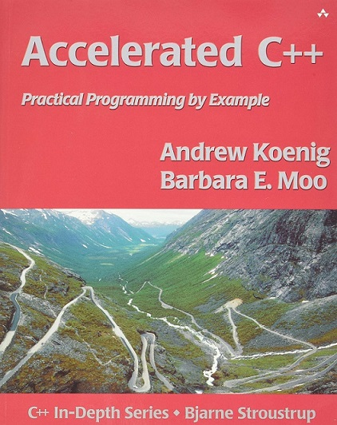

#  1. Overview
The content of this repository is based on the book [**Accelerated C++: Practical Programming by Example**](https://www.amazon.com/Accelerated-C-Practical-Programming-Example/dp/020170353X) by _Andrew Koenig and Barbara E. Moo_. It mainly consists of:
* the source code for example problems discussed in each chapter
* solutions to the exercise problems posed at the end of each chapter

# 2. Notes
* This is not intended to be an authoritative source. To my knowledge, there is no official solution guide to check against, so these are just my solutions and are therefore prone to errors and inaccuracies. Use at your own discretion.

* The tools used in this project:
	* **g++** 11.2.0
	* **CMake** 3.24.2
	* **Visual Studio Code** 1.70.2

# 3. Table of Contents
### Chapter 00
| Exercises | 0-0 | 0-1 | 0-2 | 0-3 | 0-4 | 0-5 | 0-6 | 0-7 | 0-8 | 0-9 | 0-10 |
|-----------|-----|-----|-----|-----|-----|-----|-----|-----|-----|-----|------|
| answer    | [link](/Chapter%2000#q0-0-compile-and-run-the-hello-world-program) | [link](/Chapter%2000#q0-1-what-does-the-following-statement-do) | [link](/Chapter%2000#q0-2-write-a-program-that-when-run-writes) | [link](/Chapter%2000#q0-3-the-string-literal-t-represents-a-tab-character-different-c-implementations-display-tabs-in-different-ways-experiment-with-your-implementation-to-learn-how-it-treats-tabs) | [link](/Chapter%2000#q0-4-write-a-program-that-when-run-writes-the-hello-world-program-as-its-output) | [link](/Chapter%2000#q0-5-is-this-a-valid-program-why-or-why-not) | [link](/Chapter%2000#q0-6-is-this-a-valid-program-why-or-why-not) | [link](/Chapter%2000#q0-7-what-about-this-one) | [link](/Chapter%2000#q0-8-and-this-one) | [link](/Chapter%2000#q0-9-what-is-the-shortest-valid-program) | [link](/Chapter%2000#q0-10-rewrite-the-hello-world-program-so-that-a-newline-occurs-everywhere-that-whitespace-is-allowed-in-the-program) |
| code      | [hello-world](/Chapter%2000/hello-world.cpp) | N/A | [link](/Chapter%2000/q02.cpp) | [link](/Chapter%2000/q03.cpp) | [link](/Chapter%2000/q04.cpp) | N/A | N/A | N/A | N/A | [link](/Chapter%2000/q09.cpp) | [link](/Chapter%2000/q10.cpp) |

### Chapter 01
| Exercises | 1-0 | 1-1 | 1-2 | 1-3 | 1-4 | 1-5 | 1-6 |
|-----------|-----|-----|-----|-----|-----|-----|-----|
| answer    | [link](/Chapter%2001/Exercises#q1-0-compile-execute-and-test-the-programs-in-this-chapter) | [link](/Chapter%2001/Exercises#q1-1-are-the-following-definitions-valid-why-or-why-not) | [link](/Chapter%2001/Exercises#q1-2-are-the-following-definitions-valid-why-or-why-not) | [link](/Chapter%2001/Exercises#q1-3-is-the-following-program-valid-if-so-what-does-it-do-if-not-why-not) | [link](/Chapter%2001/Exercises#q1-4-what-about-this-one-what-if-we-change--to--in-the-third-line-from-the-end) | [link](/Chapter%2001/Exercises#q1-5-is-this-program-valid-if-so-what-does-it-do-if-not-say-why-not-and-rewrite-it-to-be-valid) | [link](/Chapter%2001/Exercises#q1-6-what-does-the-following-program-do-if-when-it-asks-you-for-input-you-type-two-names-for-example-samuel-beckett-predict-the-behavior-before-running-the-program-then-try-it) |
| code      | [Examples](/Chapter%2001/Examples) | [q01](/Chapter%2001/Exercises/q01.cpp) | N/A | [q03](/Chapter%2001/Exercises/q03.cpp) | [q04](/Chapter%2001/Exercises/q04.cpp) | [q05](/Chapter%2001/Exercises/q05.cpp) | [q06](/Chapter%2001/Exercises/q06.cpp) |

### Chapter 02
| Exercises | 2-0 | 2-1 | 2-2 | 2-3 | 2-4 | 2-5 | 2-6 | 2-7 | 2-8 | 2-9 | 2-10 |
|-----------|-----|-----|-----|-----|-----|-----|-----|-----|-----|-----|------|
| answer    | [link](/Chapter%2002/Exercises#q2-0-compile-and-run-the-program-presented-in-this-chapter) | [link](/Chapter%2002/Exercises#q2-1-change-the-framing-program-so-that-it-writes-its-greeting-with-no-separation-from-the-frame) | [link](/Chapter%2002/Exercises#q2-2-change-the-framing-program-so-that-it-uses-a-different-amount-of-space-to-separate-the-sides-from-the-greeting-than-it-uses-to-separate-the-top-and-bottom-borders-from-the-greeting) | [link](/Chapter%2002/Exercises#q2-3-rewrite-the-framing-program-to-ask-the-user-to-supply-the-amount-of-spacing-to-leave-between-the-frame-and-the-greeting) | [link](/Chapter%2002/Exercises#q2-4-the-framing-program-writes-the-mostly-blank-lines-that-separate-the-borders-from-the-greeting-one-character-at-a-time-change-the-program-so-that-it-writes-all-the-spaces-needed-in-a-single-output-expression) | [link](/Chapter%2002/Exercises#q2-5-write-a-set-of--characters-so-that-they-form-a-square-a-rectangle-and-a-triangle) | [link](/Chapter%2002/Exercises#q2-6-what-does-the-following-code-do) | [link](/Chapter%2002/Exercises#q2-7-write-a-program-to-count-down-from-10-to--5) | [link](/Chapter%2002/Exercises#q2-8-write-a-program-to-generate-the-product-of-the-numbers-in-the-range-1-10) | [link](/Chapter%2002/Exercises#q2-9-write-a-program-that-asks-the-user-to-enter-two-numbers-and-tells-the-user-which-number-is-larger-than-the-other) | [link](/Chapter%2002/Exercises#q2-10-explain-each-of-the-uses-of-std-in-the-following-program) |
| code | [framing](/Chapter%2002/Examples/framing.cpp) | [q01](/Chapter%2002/Exercises/q01.cpp) | [q02](/Chapter%2002/Exercises/q02.cpp) | [q03](/Chapter%2002/Exercises/q03.cpp) | [q04](/Chapter%2002/Exercises/q04.cpp) | [q05](/Chapter%2002/Exercises/q05.cpp) | N/A | [q07](/Chapter%2002/Exercises/q07.cpp) | [q08](/Chapter%2002/Exercises/q08.cpp) | [q09](/Chapter%2002/Exercises/q09.cpp) | N/A |
### Chapter 03
| Exercises | 3-0 | 3-1 | 3-2 | 3-3 | 3-4 | 3-5 | 3-6 |
|-----------|-----|-----|-----|-----|-----|-----|-----|
| answer    | N/A | N/A | N/A | N/A | N/A | N/A | N/A |
| code      | [Examples](/Chapter%2004/Examples) | N/A | N/A | N/A | N/A | N/A | N/A |

### Chapter 04
| Exercises | 4-0 | 4-1 | 4-2 | 4-3 | 4-4 | 4-5 | 4-6 | 4-7 | 4-8 |
|-----------|-----|-----|-----|-----|-----|-----|-----|-----|-----|
| answer    | [link](/Chapter%2004/Exercises#q4-0-compile-execute-and-test-the-programs-in-this-chapter) | [link](/Chapter%2004/Exercises#q4-1-we-noted-in-42365-that-it-is-essential-that-the-argument-types-in-a-call-to-max-match-exactly-will-the-following-code-work-if-there-is-a-problem-how-would-you-fix-it) | N/A |[link](/Chapter%2004/Exercises#q4-3-what-happens-if-we-rewrite-the-previous-program-to-allow-values-up-to-but-not-including-1000-but-neglect-to-change-the-arguments-to-setw-rewrite-the-program-to-be-more-robust-in-the-face-of-changes-that-allow-i-to-grow-without-adjusting-the-setw-arguments) | N/A | [link](/Chapter%2004/Exercises#q4-5-write-a-function-that-reads-words-from-an-input-stream-and-stores-them-in-a-vector-use-that-function-both-to-write-programs-that-count-the-number-of-words-in-the-input-and-to-count-how-many-times-each-word-occurred) | N/A | N/A | [link](/Chapter%2004/Exercises#q4-8-if-the-following-code-is-legal-what-can-we-infer-about-the-return-type-of-f) |
| code      | [Examples](/Chapter%2004/Examples) | N/A | [q02](/Chapter%2004/Exercises/q02.cpp) | [q03](/Chapter%2004/Exercises/q03.cpp) | [q04](/Chapter%2004/Exercises/q04.cpp) | [q05](/Chapter%2004/Exercises/q05.cpp) | [q06](/Chapter%2004/Exercises/q06.cpp) | [q07](/Chapter%2004/Exercises/q07.cpp) | N/A |

### Chapter 05
| Exercises | 5-0 | 5-1 | 5-2 | 5-3 | 5-4 | 5-5 | 5-6 | 5-7 | 5-8 | 5-9 | 5-10 | 5-11 |
|-----------|-----|-----|-----|-----|-----|-----|-----|-----|-----|-----|------|------|
| answer    | [link](/Chapter%2005/Exercises#q5-0-compile-execute-and-test-the-programs-in-this-chapter) | [link](/Chapter%2005/Exercises#q5-1-design-and-implement-a-program-to-produce-a-permuted-index) | [link](/Chapter%2005/Exercises#q5-2-write-the-complete-new-version-of-the-student-grading-program-which-extracts-records-for-failing-students-using-vectors-write-another-that-uses-lists-measure-the-performance) | N/A | [link](/Chapter%2005/Exercises#q5-4-look-again-at-the-driver-functions-you-wrote-in-the-previous-exercise-note-that-it-is-possible-to-write-a-driver-that-differs-only-in-the-declaration-of-the-type-for-the-data-structure-that-holds-the-input-file-if-your-vector-and-list-test-drivers-differ-in-any-other-way-rewrite-them-so-that-they-differ-only-in-this-declaration) | N/A | [link](/Chapter%2005/Exercises#q5-6-rewrite-the-extract_fails-function-from-51177-so-that-instead-of-erasing-each-failing-student-from-the-input-vector-v-it-copies-the-records-for-the-passing-students-to-the-beginning-of-v-and-then-uses-the-resize-function-to-remove-the-extra-elements-from-the-end-of-v-how-does-the-performance-of-this-version-compare-with-the-one-in-51177) | [link](/Chapter%2005/Exercises#q5-7-given-the-implementation-of-frame-in-58193-and-the-code-fragment-below-describe-what-happens-in-this-call-in-particular-trace-through-how-both-the-width-function-and-the-frame-function-operate-now-run-this-code-if-the-results-differ-from-your-expectations-first-understand-why-your-expectations-and-the-program-differ-and-then-change-one-to-match-the-other) | [link](/Chapter%2005/Exercises#q5-8-in-the-hcat-function-from-58395-what-would-happen-if-we-defined-s-outside-the-scope-of-the-while-rewrite-and-execute-the-program-to-confirm-your-hypothesis) | [link](/Chapter%2005/Exercises#q5-9-write-a-program-to-write-the-lowercase-words-in-the-input-followed-by-the-uppercase-words) | N/A | N/A |
| code      | [Examples](/Chapter%2005/Examples) | N/A  | [q02-1](/Chapter%2005/Exercises/q02-1.cpp) [q02-2](/Chapter%2005/Exercises/q02-2.cpp) | [q03](/Chapter%2005/Exercises/q03.cpp) | N/A | [q05](/Chapter%2005/Exercises/q05.cpp) | [q06](/Chapter%2005/Exercises/q06.cpp) | [q07](/Chapter%2005/Exercises/q07.cpp) | [q08](/Chapter%2005/Exercises/q08.cpp) | [q09](/Chapter%2005/Exercises/q09.cpp) | [q10](/Chapter%2005/Exercises/q10.cpp) | N/A |

### Chapter 06
| Exercises | 6-0 | 6-1 | 6-2 | 6-3 | 6-4 | 6-5 | 6-6 | 6-7 | 6-8 | 6-9 |
|-----------|-----|-----|-----|-----|-----|-----|-----|-----|-----|-----|
| answer    | [link](/Chapter%2006/Exercises#q6-0-compile-execute-and-test-the-programs-in-this-chapter) | N/A | N/A | [link](/Chapter%2006/Exercises#q6-3-what-does-the-program-fragment-below-do-write-a-program-that-contains-this-fragment-and-compile-and-execute-it) | [link](/Chapter%2006/Exercises#q6-4-correct-the-program-you-wrote-in-the-previous-exercise-to-copy-from-u-into-v-there-are-at-least-two-possible-ways-to-correct-the-program-implement-both-and-describe-the-relative-advantages-and-disadvantages-of-each-approach) | N/A | [link](/Chapter%2006/Exercises#q6-6-note-that-the-function-from-the-previous-exercise-and-the-functions-from-622113-and-623115-do-the-same-task-merge-these-three-analysis-functions-into-a-single-function) | [link](/Chapter%2006/Exercises#q6-7-the-portion-of-the-grading-analysis-program-from-621110-that-read-and-classified-student-records-depending-on-whether-they-did-or-did-not-do-all-the-homework-is-similar-to-the-problem-we-solved-in-extract_fails-write-a-function-to-handle-this-subproblem) | [link](/Chapter%2006/Exercises#q6-8-write-a-single-function-that-can-be-used-to-classify-students-based-on-criteria-of-your-choice-test-this-function-by-using-it-in-place-of-the-extract_fails-program-and-use-it-in-the-program-to-analyze-student-grades) | [link](/Chapter%2006/Exercises#q6-9-use-a-library-algorithm-to-concatenate-all-the-elements-of-a-vectorstring) |
| code      | [Examples](/Chapter%2006/Examples) | [q01](/Chapter%2006/Exercises/q01.cpp) | [find_urls](/Chapter%2006/Examples/Analyzing_Strings/find_URLs_driver.cpp) | [q03](/Chapter%2006/Exercises/q03.cpp) | [q04-1](/Chapter%2006/Exercises/q04-1.cpp) [q04-2](/Chapter%2006/Exercises/q04-2.cpp)| [grading_policy](/Chapter%2006/Examples/Grading_System/src/grading_policy.cpp) | [q06](/Chapter%2006/Exercises/q06.cpp) | [q07](/Chapter%2006/Exercises/q07.cpp) | [q08](/Chapter%2006/Exercises/q08.cpp) | [q09](/Chapter%2006/Exercises/q09.cpp) | 

### Chapter 07
| Exercises | 7-0 | 7-1 | 7-2 | 7-3 | 7-4 | 7-5 | 7-6 | 7-7 | 7-8 | 7-9 |
|-----------|-----|-----|-----|-----|-----|-----|-----|-----|-----|-----|
| answer    | [link](/Chapter%2007/Exercises/README.md#q7-0-compile-execute-and-test-the-programs-in-this-chapter) | [link](/Chapter%2007/Exercises/README.md#q7-1-extend-the-program-from-72124-to-produce-its-output-sorted-by-occurrence-count-that-is-the-output-should-group-all-the-words-that-occur-once-followed-by-those-that-occur-twice-and-so-on) | [link](/Chapter%2007/Exercises/README.md#q7-2-extend-the-program-in-42364-to-assign-letter-grades-by-ranges-the-output-should-list-how-many-students-fall-into-each-category) | [link](/Chapter%2007/Exercises/README.md#q7-3-the-cross-reference-program-from-73126-could-be-improved-as-it-stands-if-a-word-occurs-more-than-once-on-the-same-input-line-the-program-will-report-that-line-multiple-times-change-the-code-so-that-it-detects-multiple-occurrences-of-the-same-line-number-and-inserts-the-line-number-only-once) | [link](/Chapter%2007/Exercises/README.md#q7-4-the-output-produced-by-the-cross-reference-program-will-be-ungainly-if-the-input-file-is-large-rewrite-the-program-to-break-up-the-output-if-the-lines-get-too-long) | [link](/Chapter%2007/Exercises/README.md#q7-5-reimplement-the-grammar-program-using-a-list-as-the-data-structure-in-which-we-build-the-sentence) | [link](/Chapter%2007/Exercises/README.md#q7-6-reimplement-the-gen_sentence-program-using-two-vectors-one-will-hold-the-fully-unwound-generated-sentence-and-the-other-will-hold-the-rules-and-will-be-used-as-a-stack-do-not-use-any-recursive-calls) | [link](/Chapter%2007/Exercises/README.md#q7-7-change-the-driver-for-the-cross-reference-program-so-that-it-writes-line-if-there-is-only-one-line-and-lines-otherwise) | [link](/Chapter%2007/Exercises/README.md#q7-8-change-the-cross-reference-program-to-find-all-the-urls-in-a-file-and-write-all-the-lines-on-which-each-distinct-url-occurs) | [link](/Chapter%2007/Exercises/README.md#q7-9-difficult-the-implementation-of-nrand-in-744135-will-not-work-for-arguments-greater-than-rand_max-usually-this-restriction-is-no-problem-because-rand_max-is-often-the-largest-possible-integer-anyway-nevertheless-there-are-implementations-under-which-rand_max-is-much-smaller-than-the-largest-possible-integer-for-example-it-is-not-uncommon-for-rand_max-to-be-32767-215--1-and-the-largest-possible-integer-to-be-2147483647-231--1-reimplement-nrand-so-that-it-works-well-for-all-values-of-n) |
| code      |[Examples](/Chapter%2007/Examples) | [q01](/Chapter%2007/Exercises/q01.cpp) | [q02](/Chapter%2007/Exercises/q02.cpp) | [q03](/Chapter%2007/Exercises/q03.cpp) | [q04](/Chapter%2007/Exercises/q04.cpp) | [q05](/Chapter%2007/Exercises/q05.cpp) | [q06](/Chapter%2007/Exercises/q06.cpp) | [q07](/Chapter%2007/Exercises/q07.cpp) | [q08](/Chapter%2007/Exercises/q08.cpp) | N/A | 