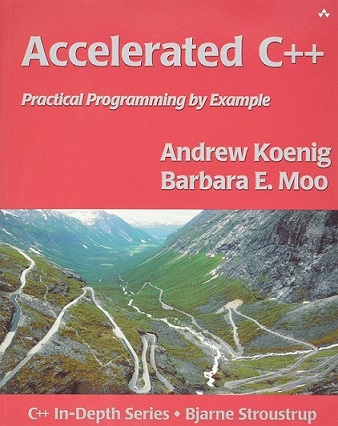

#  1. Overview
The content of this repository is based on the book [**Accelerated C++: Practical Programming by Example**](https://www.amazon.com/Accelerated-C-Practical-Programming-Example/dp/020170353X) by _Andrew Koenig and Barbara E. Moo_. It mainly consists of:
* the source code for example problems discussed in each chapter
* solutions to the exercise problems posed at the end of each chapter

# 2. Notes
* This is not intended to be an authoritative source. To my knowledge, there is no official solution guide to check against, so these are just my solutions and are therefore prone to errors and inaccuracies. Use at your own discretion.

* The tools used in this project:
	* **g++** 11.2.0
	* **CMake** 3.24.2
	* **Visual Studio Code** 1.70.2

# 3. Table of Content

### Chapter 05
| Exercises | 5-0 | 5-1 | 5-2 | 5-3 | 5-4 | 5-5 | 5-6 | 5-7 | 5-8 | 5-9 | 5-10 |
|-----------|-----|-----|-----|-----|-----|-----|-----|-----|-----|------|
| Link | [Examples](/Chapter%2005/Examples) | [link](/Chapter%2005/Exercises#q5-1-design-and-implement-a-program-to-produce-a-permuted-index)  |  [q02-1](/Chapter%2005/Exercises/q02-1.cpp) , [q02-2](/Chapter%2005/Exercises/q02-2.cpp) | [q03](/Chapter%2005/Exercises/q03.cpp) | [link](/Chapter%2005/Exercises#q4-4-look-again-at-the-driver-functions-you-wrote-in-the-previous-exercise-note-that-it-is-possible-to-write-a-driver-that-differs-only-in-the-declaration-of-the-type-for-the-data-structure-that-holds-the-input-file-if-your-vector-and-list-test-drivers-differ-in-any-other-way-rewrite-them-so-that-they-differ-only-in-this-declaration) | [q05](/Chapter%2005/Exercises/q05.cpp) | [q06](/Chapter%2005/Exercises/q06.cpp) | [q07](/Chapter%2005/Exercises/q07.cpp) | [q08](/Chapter%2005/Exercises/q08.cpp) | [q09](/Chapter%2005/Exercises/q09.cpp) | [q10](/Chapter%2005/Exercises/q10.cpp) |